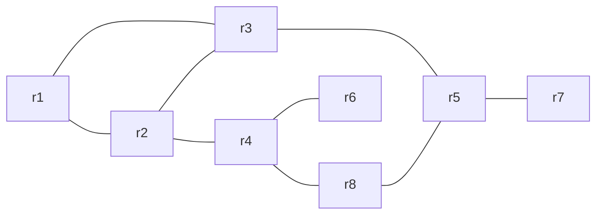

# OSPF-Gaming

OSPF-Gaming is a proof-of-concept, QoS-aware link-state routing protocol tuned for interactive traffic such as online gaming. The daemon extends traditional OSPF concepts with active latency, jitter, packet loss, and bandwidth awareness so that the best next-hop is calculated with end-to-end quality in mind.

## What's new (current version)

- **Normalized cost calculation (max 100):**
  - Metrics are normalized to 0..1 range using configurable thresholds
  - Balanced percentage weights that sum to 100
  - Example: latency=25%, jitter=35%, loss=30%, bandwidth=10%
  - Cost formula ensures maximum possible cost is 100

- **Jitter-first metric calculation:**
  - Extracts per-packet RTT samples from `ping` output and computes jitter as statistical standard deviation
  - Fallbacks: `mdev` from `ping` summary (if available), then `max - min`, then 0.0
  - Debug logs include "Jitter calculado de N amostras: X.XXX ms"

- **Configurable sampling:**
  - `ping_count` and `ping_interval` per router in JSON
  - Enhanced precision with more samples (default: 20 pings)

- **Eight-router topology:**
  - Updated topology now includes 8 routers (r1–r8)
  - New router r8 acts as intermediary between r4 and r5
  - Clean hostname resolution (no more .luisdorr-red suffixes)

## Repository structure

| File/Dir | Description |
| --- | --- |
| `docker-compose.yml` | Docker Compose topology with eight FRRouting routers (r1–r8) with clean hostnames |
| `ospf_gaming_daemon.py` | Multithreaded Python daemon for OSPF-Gaming, maintains link-state and syncs kernel routes |
| `metrics.py` | QoS measurement helpers (latency, jitter-first, packet loss, static bandwidth catalog) |
| `algorithm.py` | Dijkstra-based shortest path used to build routing tables |
| `route_manager.py` | Thin wrapper around `ip route` to add/remove routes |
| `config/` | JSON configs for each router (`r1.json` … `r8.json`) |
| `topologia.mermaid` | Mermaid diagram describing the lab topology |
| `generate_compose.py` | Helper script to generate/update docker-compose from configs |
| `generate_graph.py`, `analysis.py` | Utilities for visualization/analysis |

## Topology

Current network topology (8 routers):



Addressing follows per-link /24 subnets:
- r1–r2: 10.0.12.0/24 (r1: .2, r2: .3)
- r1–r3: 10.0.13.0/24 (r1: .2, r3: .3)
- r2–r3: 10.0.23.0/24 (r2: .2, r3: .3)
- r2–r4: 10.0.24.0/24 (r2: .2, r4: .3)
- r3–r5: 10.0.35.0/24 (r3: .2, r5: .3)
- r4–r8: 10.0.48.0/24 (r4: .2, r8: .3)
- r5–r8: 10.0.58.0/24 (r5: .3, r8: .2)
- r4–r6: 10.0.46.0/24 (r4: .2, r6: .3)
- r5–r7: 10.0.57.0/24 (r5: .2, r7: .3)

## Launching the lab

1) **Prerequisites:** Docker and Docker Compose installed

2) **Start the lab:**
```bash
docker-compose up -d
```

3) **Verify containers:**
```bash
docker-compose ps
```

4) **Follow logs** (replace `r1` with any router):
```bash
docker logs -f r1
```

The project directory is bind-mounted into `/opt/ospf-gaming` inside each container.

## Configuration

Each router has a JSON file under `config/` with basic configuration. The daemon supports enhanced configuration with normalized cost weights:

### Basic configuration (current):
```json
{
  "router_id": "r1",
  "listen_ip": "0.0.0.0",
  "listen_port": 55000,
  "hello_interval": 5,
  "metric_interval": 30,
  "neighbors": [
    { "id": "r2", "ip": "10.0.12.3", "port": 55000 },
    { "id": "r3", "ip": "10.0.13.3", "port": 55000 }
  ]
}
```

### Enhanced configuration (optional):
```json
{
  "router_id": "r1",
  "listen_ip": "0.0.0.0",
  "listen_port": 55000,
  "hello_interval": 5,
  "metric_interval": 30,
  
  "ping_count": 20,
  "ping_interval": 0.1,
  
  "weights_percent": {
    "latency": 25,
    "jitter": 35,
    "loss": 30,
    "bandwidth": 10
  },
  
  "normalization": {
    "latency_max_ms": 100,
    "jitter_max_ms": 20,
    "bandwidth_ref_mbps": 1000
  },
  
  "neighbors": [
    { "id": "r2", "ip": "10.0.12.3", "port": 55000 },
    { "id": "r3", "ip": "10.0.13.3", "port": 55000 }
  ]
}
```

After changes to configs, restart the affected container:
```bash
docker-compose restart r3
```

## Cost calculation (normalized system)

The daemon uses a normalized cost system with a maximum total cost of 100:

### Normalization (0..1 range):
- `lat_norm = min(1.0, latency_ms / latency_max_ms)`
- `jit_norm = min(1.0, jitter_ms / jitter_max_ms)`
- `loss_norm = min(1.0, loss_percent / 100)`
- `bw_norm = 1.0 - min(1.0, bandwidth_Mbps / bandwidth_ref_Mbps)`

### Weighted cost (percentages sum to 100):
- `cost = lat_norm × 25% + jit_norm × 35% + loss_norm × 30% + bw_norm × 10%`

### Default values:
- **Weights:** latency=25%, jitter=35%, loss=30%, bandwidth=10%
- **Thresholds:** latency_max=100ms, jitter_max=20ms, bandwidth_ref=1000Mbps

### Debug logs example:
```
[DEBUG] Cost calculation: lat=(0.13/100.0)=0.00*25=0.03, jit=(0.03/20.0)=0.00*35=0.05, loss=(0.00/100)=0.00*30=0.00, bw=(1-1.00)=0.00*10=0.00, total=0.08
```

## Metric collection

The daemon runs per neighbor:
- `ping -c <ping_count> -i <ping_interval> <neighbor_ip>` (LANG=C for parse stability)
- Parses packet loss and RTT summary (min/avg/max[/mdev] when available)
- Extracts per-echo RTTs to compute jitter (standard deviation) primarily

Jitter calculation priority:
1. **Statistical standard deviation** from per-packet RTT samples (primary)
2. **mdev** from ping summary (if available, fallback)
3. **max - min** RTT range (fallback)
4. **0.0** (if no data available)

## Testing with network conditions

To test the QoS-aware routing, you can induce jitter and packet loss:

### 1) Find the interface to a neighbor:
```bash
docker exec r1 ip route get 10.0.12.3
# Note the "dev ethX"
```

### 2) Add network conditions:

**Random packet loss (5% with 25% correlation):**
```bash
docker exec r1 tc qdisc add dev ethX root netem loss 5% 25%
```

**Delay with jitter (25ms ±5ms normal distribution):**
```bash
docker exec r1 tc qdisc add dev ethX root netem delay 25ms 5ms distribution normal
```

**Combined conditions:**
```bash
docker exec r1 tc qdisc add dev ethX root netem delay 25ms 5ms loss 2%
```

### 3) Remove conditions:
```bash
docker exec r1 tc qdisc del dev ethX root
```

### 4) Alternative (ICMP-only loss with iptables):
```bash
# Add 5% random packet loss for ping
docker exec r1 iptables -I OUTPUT -d 10.0.12.3 -p icmp --icmp-type echo-request -m statistic --mode random --probability 0.05 -j DROP

# Remove the rule
docker exec r1 iptables -D OUTPUT -d 10.0.12.3 -p icmp --icmp-type echo-request -m statistic --mode random --probability 0.05 -j DROP
```

## Tips and troubleshooting

### Clean route output:
- Use numeric output to avoid long hostnames: `docker exec r1 route -n`
- Or use: `docker exec r1 ip route`

### Debugging jitter calculation:
- Check logs for: `"Jitter calculado de N amostras: X.XXX ms"`
- If jitter shows as 0.00, increase `ping_count` or `ping_interval`
- Induce jitter with `tc netem` to validate detection

### Router connectivity:
- Check daemon logs for Hello packet exchange
- Ensure neighbors' metrics are finite (not inf)
- Verify LSDB has prefixes for route installation

### Container management:
```bash
# Restart specific router
docker-compose restart r3

# View all container status
docker-compose ps

# Follow logs for debugging
docker logs -f r1

# Execute commands inside router
docker exec -it r1 bash
```

### Ping format compatibility:
- If you don't see "mdev" in ping summary, the image uses busybox ping
- Jitter is still computed from per-packet samples
- iputils-ping provides mdev as additional fallback

## Roadmap

Future enhancements:
- LSA aging and reliable flooding mechanisms
- Topology state persistence across restarts
- Integration with FRRouting's zebra for dynamic interface discovery
- Priority queuing for gaming traffic classification
- Real-time bandwidth measurement (replacing static catalog)
- Web-based topology visualization and monitoring dashboard
